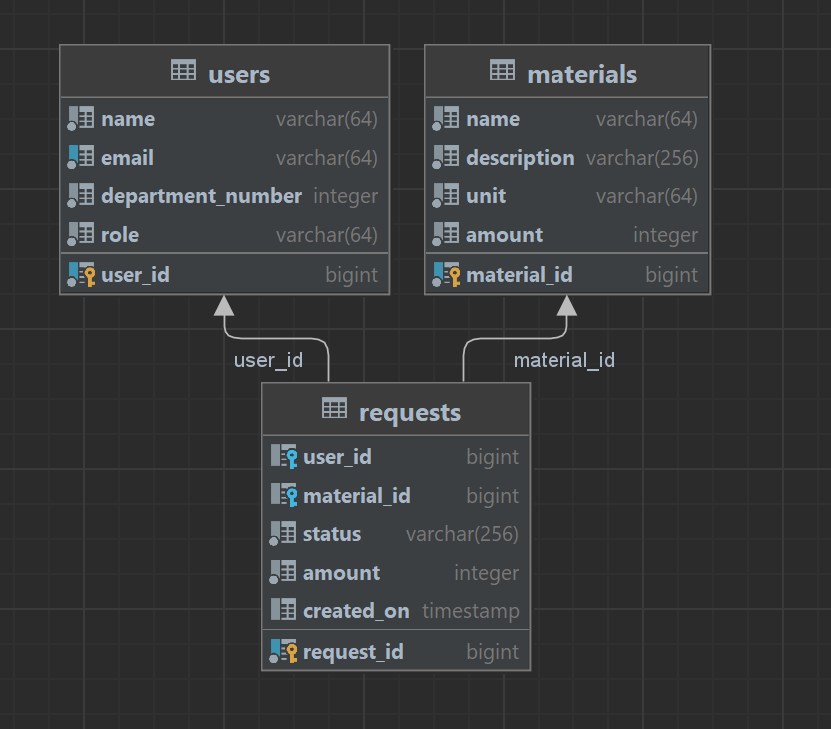

accounting_requirements
### «Приложение для создания и обработки требований для получения материалов со склада.»

Приложение содержит три основных сущности: пользователь (User), материал (Material), требование (заявка, Request).
1. Объект "Пользователь" (User). Имеет следующие поля:
   1. id - уникальный идентификатор пользователя (генерируется автоматически);
   2. name - ФИО пользователя;
   3. departmentNumber - номер подразделения;
   4. email - электронная почта (уникальный параметр);
   5. role - роль (создание или обработка запросов);
2. Объект "Материал" (Material)
   1. id - уникальный идентификатор материала (генерируется автоматически);
   2. name - наименование материала;
   3. description - описание материала;
   4. unit - единица измерения;
   5. amount - количество в единицах измерения;
3. Объект "Требование" (Request)
   1. id - уникальный идентификатор пользователя (генерируется автоматически);
   2. requestor - пользователь, создавший требование (связь ManyToOne);
   3. Material - запрашиваемый материал (связь ManyToOne);
   4. RequestStatus - статус запроса (Ожидает рассмотрения, Согласовано, Отклонено);
   5. amount - запрашиваемое количество;

Приложение выполнено в виде монолита, разделение структуры проекта по принципу "слоёв". Использована версия Java 11, SpringBoot 2.7.5, БД PostgreSQL.

Схема БД:

Схема Эндпоинтов приложения.

Контроллер Пользователей:
1) Post("/users") - создание пользователя, должен содержать тело запроса (пример см. ниже).

        "name": "Rick Sanches",
        "email": "email0@yandex.ru",
        "departmentNumber": 1,
        "role": "SUPERVISOR"

2) Patch("/users/{userId}") - обновление пользователя, должен содержать тело запроса. 
Обновить можно только номер подразделения и роль.
3) Get("/users/{userId}") - возвращает пользователя по id.
4) Delete("/users/{userId}") - удаление пользователя по id.

Контроллер материалов (создавать, редактировать и удалять могут только пользователи с ролью SUPERVISOR):
1) Post("/materials") - создание материала, должен содержать тело запроса (пример см. ниже) и параметр userId.

        "name": "Сталь СТ3",
        "description": "ГОСТ 380-2005",
        "unit":  "кг",
        "amount": 1000

2) Patch("/materials/{materialId}") - обновление материала, должен содержать тело запроса и параметр userId. 
Обновить можно только количество. 
3) Get("/materials/{materialId}") - возвращает материал по id.
4) Get("/materials") - возвращает список всех материалов. Может (необязательно) содержать параметры постраничного 
вывода from и size. 
5) Delete("/materials/{materialId}") - удаление материала по id, должен содержать параметр userId.

Контроллер требований (редактировать и удалять конкретное требование может только пользователь - создатель, 
изменять статус требования могут только пользователи с ролью SUPERVISOR):
1) Post("/requests") - создание требования, должен содержать тело запроса (пример см. ниже) и параметр userId.

        "materialId": 1,
        "amount": 1000

2) Patch("/requests/{requestId}") - создание требования, должен содержать тело запроса и параметр userId. 
3) Patch("/requests/process/{requestId}") - обновление статуса требования, должен содержать параметры userId и status. 
При одобрении конкретного требования сервис проверяет его статус (одобрить или отклонить можно только ожидающее обработки требвоание) 
и сравнивает количество затребованного материала с материалом на складе. 
В случае удачного одобрения количество материала на складе автоматически обновляется.
4) Get("/requests/{requestId}") - возвращает требование по id.
5) Get("/requests") - возвращает список требований. Может (необязательно) содержать параметры постраничного
   вывода from и size.
6) Get("/requests/pending") - возвращает список требований, ожидающих подтверждения. 
Может (необязательно) содержать параметры постраничного вывода from и size.
7) Delete("/requests/{requestId}") - удаление требования по id.

Примеры взаимодействия со всеми эндпоинтами и тесты представлены в виде Postman коллекции и доступны в структуре проекта (пакет postman).

Зависимости, подключенные к проекту:
1) spring-boot-starter-data-jpa - Starter для использования Spring Data JPA с Hibernate
2) spring-boot-starter-web - Starter для создания web, включая RESTful, приложений, используя Spring MVC. Использует Tomcat как встроенный контейнер по умолчанию
3) spring-boot-starter-validation - Starter для использования Java Bean Validation с Hibernate Validator
4) spring-boot-starter-test - Starter для тестирования Spring Boot приложений с библиотеками JUnit, Hamcrest и Mockito
5) postgresql - база данных  postgres
6) lombok - библиотека для сокращения кода в классах и расширения функциональности языка Java.

Точка запуска через среду разработки - класс AccountingRequirementsAppApplication (требуется "поднятая" БД, параметры - см. application.properties).
Для удобного развертывания в докере контейнеров с приложением и БД создан файл docker-compose.yml. 
Для Запуска: через консоль перейти в папку с проектом, выполнить команду docker-compose up. 

